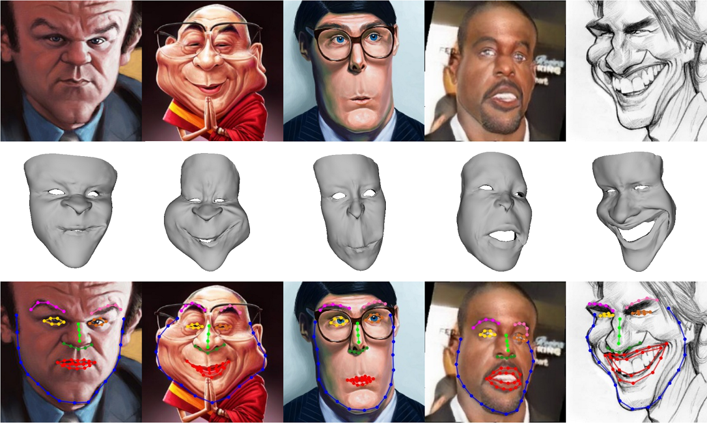

# CaricatureFace
This repository includes source code, pretrained model and a testset of paper "Landmark Detection and 3D Face Reconstruction for Caricature using a Nonlinear Parametric Model", [http://arxiv.org/abs/2004.09190](http://arxiv.org/abs/2004.09190).



## Update Logs:
### April 22, 2020
* The testset are enlarged.
### April 8, 2020
* The source code, pretrained model and some data from testset are released.


## Comparison with us
If you want to do some comparison with our method, you can download a testset here [Google Drive](https://drive.google.com/open?id=1fGHlV8ISUkgCK8OSTQxvEJxtxXXrwjDI), or [Baidu Drive](https://pan.baidu.com/s/1YhniT8yb6C5yvO9gq_YYoA) with password: 4nvs. It includes 2D caricatures, groundtruth 68 landmarks, 68 landmarks detected by our method and 3D meshes recovered by our method.

## Prerequisites and Installation
- Python 3.7
- Pytorch 1.4.0
- opencv-python 3.4.2

### Getting Started
**Clone this repository:**
```bash
git clone git@github.com:Juyong/CaricatureFace.git
cd CaricatureFace
```
**Install dependencies using Anaconda:**
 ```bash
conda create -n cariface python=3.7
source activate cariface
pip install -r requirements.txt
```

## Advanced Work
**Prepare related data:**
- You can download related data for alogorithm here [Google Drive](https://drive.google.com/open?id=11m9dC6j-SUyjhtSiXsUqiBdZOQ3S8phD), or [Baidu Drive](https://pan.baidu.com/s/1v4V-7rYszDhyhzhCH2aYeA) with password: tjps.
- Unzip downloaded files and move files into ```./data``` directory.

**Prepare pretrained model:**
- You can download pretrained model here [Google Drive](https://drive.google.com/open?id=1If_rjQp5mDZMbK1-STGYOPyw_cTG66jO), or [Baidu Drive](https://pan.baidu.com/s/113QFM-zhSUIZfzjFhQfTTA) with password: fukf.
- Unzip downloaded files and move files into ```./model``` directory.

**Prepare some examples:**
- You can download some examples here [Google Drive](https://drive.google.com/open?id=1X8TpVpGzRrQuSS93_Hb32ERU-P4q6SSG), or [Baidu Drive](https://pan.baidu.com/s/18V7Ulq9ZfACtuhpkBJY6-A) with password: unud.
- Unzip downloaded files and move files into ```./exp``` directory.

## Test with Pretrained Model
Within ```./CaricatureFace``` directory, run following command:
 ```bash
    bash test.sh
```

Note: Input images must be preprocessed - crop the whole face roughly and resize to size (224, 224).

## Train
Firstly, prepare a training set. Then within ```./CaricatureFace``` directory, run following command:
 ```bash
    python train.py --no_premodel
```

## Citation
If you find this useful for your research, please cite the paper.
